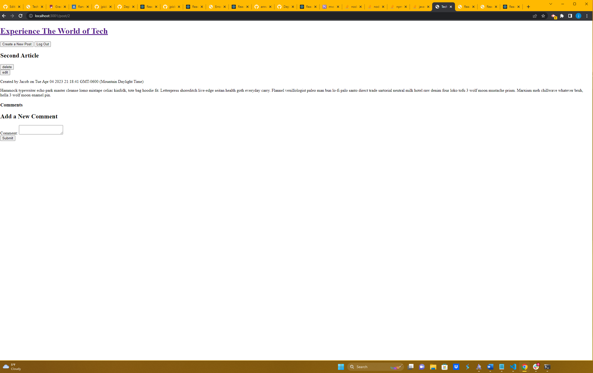
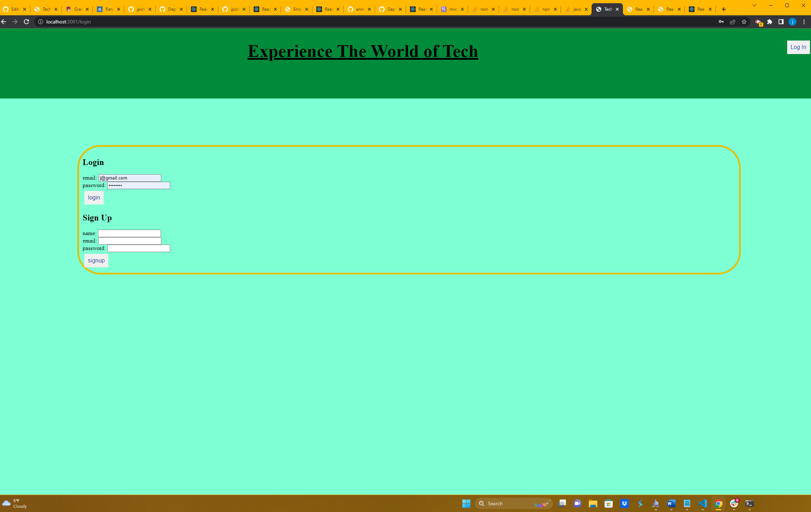
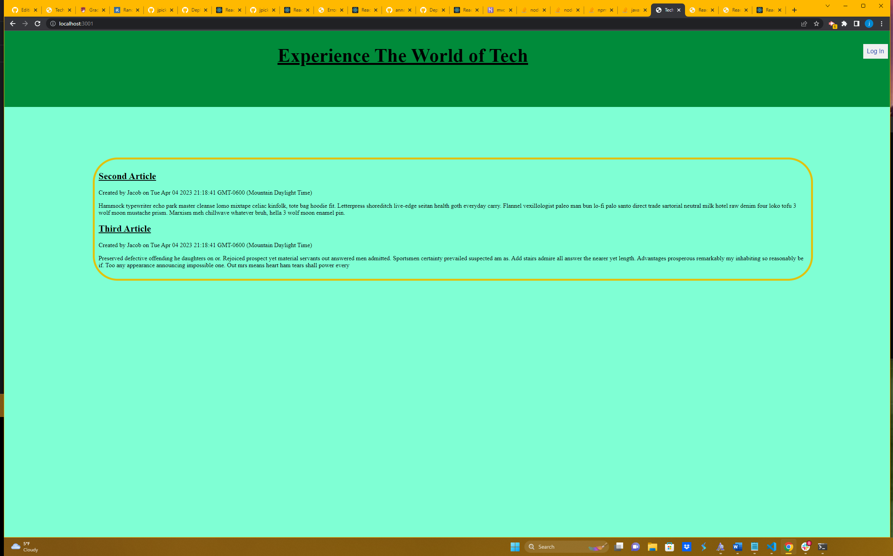

# MVC-Blog 

  ## Description
  This is a test website that allows the CRUD methods (Create, Read, Update, Delete) on various "tech" posts. But the user must be loggedin or sign up to interact with the website. Then the user can create, edit, or delete post on their website.

  ## Table of Contents

  - [installation](#installation)

  - [usage](#usage)

  - [license](#license)

  - [test](#test)

  - [contrabution](#contrabution)

  - [questions](#questions)

  ## Installation
  The npmpackages used for this app: handlebars, JavaScript, node.js, express, Bcryptjs, MySQL, Sequelize, Heroku.

  ## Usage
  The user must go into the terminaland run the command "npm run build" to build the build folder. Then the user must run "npm run deploy" to create the gh-pages in order to develop.

  ## License
  MIT

  ## Test
  "npm run test"

  ## Contrabution
  Users can contribute through my GitHub.

  ## Questions
  [jpick77](https://github.com/jpick77)

  jpickron30@gmail.com

  ## Screenshots
  
  
  
